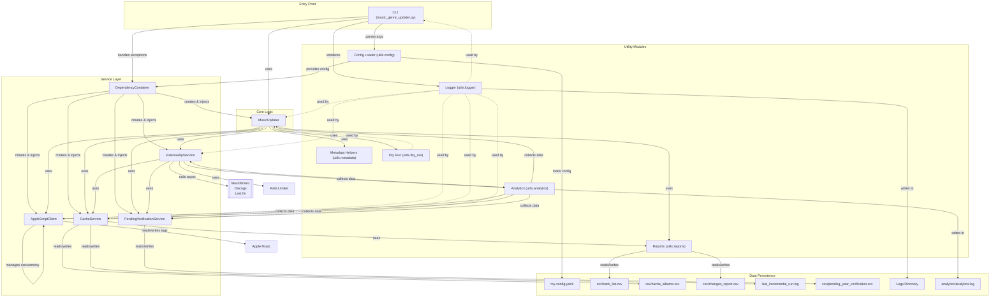

# System Patterns & Conventions

## 1. Code style

The code is formatted using **Black** and **Isort** with a line length of **150 characters**, according to the configuration in `pyproject.toml`. It also uses **Flake8** for style checking and **Mypy** for static type checking, which are also configured in `pyproject.toml`.

- Comments in English, log messages in Ukrainian.

## 2. High-Level Architecture (HLD)

The "Music Genre Updater" project is designed to automate the management of Apple Music libraries. Its architecture is modular and asynchronous, built around a Dependency Injection pattern to ensure testability and maintainability.

**Key Components:**

1. **CLI (Command Line Interface):**

   - The entry point (`music_genre_updater.py`) uses `argparse` to parse command-line arguments (`--force`, `--dry-run`, `clean_artist`, `update_years`, `verify_database`, `verify_pending`).
   - Handles initial configuration loading (`my-config.yaml`) via `utils.config.load_config`.
   - Initializes the logging system (`utils.logger.get_loggers`).
   - Orchestrates the execution flow based on the parsed command.
   - Handles top-level exceptions and shutdown procedures.

2. **Dependency Container (`services/dependencies_service.py`):**

   - A central class (`DependencyContainer`) responsible for creating and managing instances of all core services and the main orchestrator (`MusicUpdater`).
   - Injects necessary dependencies into services and `MusicUpdater` during initialization.
   - Provides an asynchronous `initialize` method to handle services requiring async setup (e.g., loading data from disk, creating semaphores).
   - Includes a `shutdown` method for graceful cleanup of resources (e.g., closing aiohttp session, stopping logging listener, syncing caches).

3. **MusicUpdater (`music_genre_updater.py`):**

   - The main orchestrator class (`MusicUpdater`) containing the core business logic and process flows.
   - Receive instances of various services (AppleScriptClient, CacheService, ExternalApiService, PendingVerificationService, Analytics, loggers) via dependency injection in its `__init__` method.
   - Contains methods for different operations: `run_full_process`, `run_clean_artist`, `run_update_years`, `run_verify_database`, `run_verify_pending`.
   - Uses injected services and utility functions to perform tasks like fetching tracks, cleaning metadata, determining genres, retrieving years, verifying the database, and managing pending verifications.

4. **Service Layer (`services/`):**

   - A collection of specialized asynchronous services handling external interactions and complex logic.
   - **`AppleScriptClient` (`services/applescript_client.py`):**
     - Interacts with Apple Music via `osascript`.
     - Provides methods `run_script` (for `.applescript` files) and `run_script_code` (for inline code).
     - Manages concurrency using a `asyncio.Semaphore` (initialized asynchronously).
     - Handles script timeouts and error reporting.
   - **`CacheService` (`services/cache_service.py`):**
     - Provides a multi-tiered caching system.
     - In-memory cache for generic data with TTL.
     - Persistent CSV-based cache (`csv/cache_albums.csv`) for album years. Uses SHA256 hashing for keys.
     - Asynchronous methods for getting (`get_async`, `get_album_year_from_cache`), setting (`set_async`, `store_album_year_in_cache`), and invalidating cache entries.
     - Includes logic for tracking and reading the last incremental run timestamp.
     - Uses `loop.run_in_executor` for blocking file I/O (loading/saving CSVs).
   - **`ExternalApiService` (`services/external_api_service.py`):**
     - Interacts with external music metadata APIs (MusicBrainz, Discogs, Last.fm).
     - Uses `aiohttp` for asynchronous HTTP requests.
     - Implements `EnhancedRateLimiter` for each API to respect rate limits and manage concurrency.
     - Contains sophisticated logic for determining the original release year of albums based on data from multiple sources and a scoring algorithm.
     - Uses injected `CacheService` to cache artist activity periods and album years.
     - Uses injected `PendingVerificationService` to mark albums for future re-verification if a definitive year cannot be found.
   - **`PendingVerificationService` (`services/pending_verification.py`):**
     - Manages a persistent list of albums that require future year re-verification.
     - Stores pending albums with timestamps in a CSV file (`csv/pending_year_verification.csv`), using hash-based keys.
     - Asynchronous methods for marking (`mark_for_verification`), checking if verification is needed (`is_verification_needed`), removing (`remove_from_pending`), and retrieving pending albums.
     - Uses `asyncio.Lock` for thread-safe access to the in-memory pending list.
     - Uses `loop.run_in_executor` for blocking file I/O (loading/saving CSV).

5. **Utility Modules (`utils/`):**

   - Contains various helper functions used across the application.
   - `utils.config`: Handles loading and validation of `my-config.yaml`.
   - `utils.logger`: Provides custom logging setup with multiple handlers (console, file) and color coding. Manages log file paths and rotation.
   - `utils.analytics`: Tracks performance metrics and generates reports (HTML, log summary). Uses decorators for instrumentation.
   - `utils.metadata`: Contains functions for parsing AppleScript output, cleaning names, grouping tracks, and determining dominant genres.
   - `utils.reports`: Handles loading track data from CSV (`load_track_list`), saving data to CSV (`save_to_csv`), and generating unified changes reports (`save_unified_changes_report`).
   - `utils.dry_run`: Contains logic for simulating operations in dry-run mode without modifying Music.app.

6. **Data Persistence:**
   - Configuration: `my-config.yaml` (YAML)
   - Track Database: `csv/track_list.csv` (CSV) - stores processed track metadata.
   - Album Year Cache: `csv/cache_albums.csv` (CSV) - stores determined album years.
   - Changes Report: `csv/changes_report.csv` (CSV) - logs all applied changes.
   - Last Incremental Run: `last_incremental_run.log` (text file) - stores timestamp of the last incremental run.
   - Pending Verification: `csv/pending_year_verification.csv` (CSV) - stores albums needing re-verification.
   - Logs: Various files in the configured logs' directory (`logs_base_dir`).
   - Analytics Data: Stored in memory during a run, potentially saved to `analytics/analytics.log` and used for HTML reports.

**Control Flow (High-Level):**

1. Script starts, parses arguments, loads config.
2. Logging is initialized.
3. `DependencyContainer` is created, instantiating services and `MusicUpdater`.
4. `DependencyContainer.initialize()` is called asynchronously to set up services (load caches, create semaphores).
5. Based on command-line arguments, the main logic calls the appropriate method on the `MusicUpdater` instance (`run_full_process`, `run_clean_artist`, etc.).
6. `MusicUpdater` methods orchestrate the process, calling methods on injected services and utility functions.
7. Services interact with external systems (Apple Music via AppleScript, external APIs) and manage data (caches, pending list, CSV files).
8. Utility functions perform common data manipulation tasks.
9. Logging and analytics capture operational details and performance metrics throughout.
10. At the end of execution (or on interruption), `DependencyContainer.shutdown()` is called for cleanup.

## 2.1. Component Diagram

## 3. Design Patterns

The project utilizes several design patterns to improve structure, maintainability, and resilience:

| Pattern                | Place in the code                  | Description                                                                                                             |
| ---------------------- | ---------------------------------- | ----------------------------------------------------------------------------------------------------------------------- |
| Dependency Injection   | services/**init**.py               | Centralized management and injection of service dependencies into `MusicUpdater` for better testability and modularity. |
| Strategy (genre rules) | helpers/metadata.py                | Encapsulating different genre determination rules/algorithms, allowing easy switching or extension.                     |
| Retry (Tenacity)       | services/\_external_api_service.py | Automatically retrying failed API calls with configurable delays and attempts to handle transient network issues.       |
| Facade                 | music_genre_updater.py             | Providing a simplified interface (`MusicUpdater` class) to the underlying complex system of services and utilities.     |

## 4. Git / CI

- `main` branch strategy: The `main` branch is used for stable releases, with release tags created for each version.
- **Pre-commit Hook:** A pre-commit hook is configured to run the `scripts/update_memory_bank.py` script. This script automatically generates a markdown snippet summarizing the staged changes (list of modified files and their diffs) and prepends it to the `activeContext.md` file in the memory bank. This helps maintain a living documentation/context of recent code changes within the wiki.
- GitHub Actions: (yet-to-add) - Planned for Continuous Integration (e.g., running tests, linters, type checks) and potentially Continuous Deployment (creating releases).
