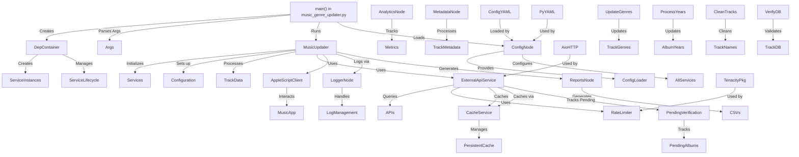

Ось повний вміст вашого актуального файлу README.md (збережено форматування, стилі та структуру):

```markdown
# Python Scripts

Hey! 👋 This repo is a toolbox of Python scripts (plus a dash of AppleScript) for all sorts of automation fun—mostly tuned for macOS (Sonoma and newer), but written with flexibility and maintainability in mind.

---

## Structure at a Glance

### Main Attraction: `Genres Autoupdater v2.0/`

A self-contained engine for automatically updating music genres—think of it as your personal DJ’s assistant, with all the knobs and dials out in the open (thanks to robust config files).

**What’s inside:**

- **config.yaml** – Drop all your paths, credentials, update rules, API keys, etc., in here. No more hardcoding!
- **requirements.txt** – Python dependencies (right now, just PyYAML, but check for updates).
- **music_genre_updater.py** – Main script; reads configs, kicks off the logic, and pulls in helpers/services.
- **full_sync.py** – For bigger jobs—full library syncs or batch updates.
- **AppleScripts/** – AppleScript snippets for macOS-native automation (like controlling Music.app).
- **services/** – All integrations with third-party APIs or external systems.
- **utils/** – Your toolbox: logging, YAML/file helpers, and more.
- **readme.md** – Local docs: setup, usage, troubleshooting.
- **image.png** – Diagrams/screenshots to help you visualize what’s what.

Other scripts? You’ll find them at the repo root or in similar subfolders.

---

## Quickstart

**Python version:**
Check `.python-version`, `pyproject.toml`, or inside each script. If nothing’s set, just run the latest stable Python 3.x.

**Install dependencies:**

```sh
cd "Genres Autoupdater v2.0"
pip install -r requirements.txt
```

**Python version management (recommended):**

```sh
brew install pyenv
pyenv install <desired_version>
pyenv global <desired_version>
```

---

## How to Use

Every script here is self-contained.
**Pro-tip:** Always stash your settings in `config.yaml`—it’ll save you headaches and make your setup portable.

```sh
python music_genre_updater.py
```

Or, if your batch processing:

```sh
python full_sync.py
```

---

## How It All Connects (Detailed Architecture)

Let’s get nerdy for a sec. Here’s a file-level breakdown of how `Genres Autoupdater v2.0` ticks under the hood:



> **TL;DR:**
>
> - `music_genre_updater.py` is the shot-caller.
> - All your settings (paths, keys, etc.) go into `config.yaml`—no more cluttering your code with secrets or magic numbers.
> - Utilities, services, and AppleScripts are modular, so you can swap or extend without breaking a sweat.
> - Batch processing? That’s what `full_sync.py` is for.
> - Local docs and images keep things easy to onboard for the next person (or future you).

---

## Contribution & Best Practices

- Stick to the coding style & docstring conventions—makes everyone’s life easier.
- Move all settings into config files. Hardcoding is for amateurs! 😄
- Every function/class should have a docstring with examples.
- Don't just delete stuff—if you really must, explain why (line-by-line if it's complex).
- Add logging where it makes sense, especially in helpers and services.
- If you're tweaking for macOS, AWS CLI, Terraform, or Python/Brew/pyenv, keep it idiomatic.

**How to contribute:**

1. Fork this repo.
2. Make a new branch (`git checkout -b feature-branch`).
3. Commit your changes (`git commit -am 'Describe your feature'`).
4. Push (`git push origin feature-branch`).
5. Open a Pull Request.

---

## License

MIT License – see [LICENSE](LICENSE) for details.

---

## Why This Structure?

- **Maximum flexibility:** All parameters outside the code.
- **Modular:** Each piece—core, services, utils, AppleScripts—is swappable and testable.
- **Extensible:** Add new genres, sources, or automations with barely any refactoring.
- **macOS native:** AppleScript and Python work hand-in-hand for deep integration.
- **Dev-friendly:** Docs, config, and code are always in sync for easy onboarding.

---

If you need a drilldown into a specific script or want to see function-level data flows (or want to geek out about something in the code), ping me! Always happy to help make your automation smarter.

---

**PS:** Don’t forget to keep your `config.yaml` out of version control if it has sensitive data—add it to `.gitignore`!
```
