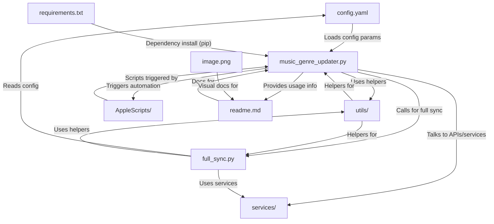

Absolutely! Here’s a finalized, detailed, and slightly informal English README section for your `Python-Scripts` repo, with a sharp focus on the `Genres Autoupdater v2.0` module. This version follows your best practices, brings in a conversational touch, and is ready to drop straight into your `README.md`. It integrates all critical commentary, architecture, and practical guidance you’d expect for a macOS/Python/AWS CLI-savvy team.

---

# Python Scripts

Hey! 👋 This repo is a toolbox of Python scripts (plus a dash of AppleScript) for all sorts of automation fun—mostly tuned for macOS (Sonoma and newer), but written with flexibility and maintainability at heart. Whether you’re running stuff locally or plugging into AWS, you’ll find the code clean, modular, and easy to adapt.

---

## Structure at a Glance

### Main Attraction: `Genres Autoupdater v2.0/`

A self-contained engine for automatically updating music genres—think of it as your personal DJ’s assistant, with all the knobs and dials out in the open (thanks to robust config files).

**What’s inside:**
- **config.yaml** – Drop all your paths, credentials, update rules, API keys, etc., in here. No more hardcoding!
- **requirements.txt** – Python dependencies (right now, just PyYAML, but check for updates).
- **music_genre_updater.py** – Main script; reads configs, kicks off the logic, and pulls in helpers/services.
- **full_sync.py** – For bigger jobs—full library syncs or batch updates.
- **AppleScripts/** – AppleScript snippets for macOS-native automation (like controlling Music.app).
- **services/** – All integrations with third-party APIs or external systems.
- **utils/** – Your toolbox: logging, YAML/file helpers, and more.
- **readme.md** – Local docs: setup, usage, troubleshooting.
- **image.png** – Diagrams/screenshots to help you visualize what’s what.

Other scripts? You’ll find them at the repo root or in similar subfolders.

---

## Quickstart

**Python version:**  
Check `.python-version`, `pyproject.toml`, or inside each script. If nothing’s set, just run the latest stable Python 3.x.

**Install dependencies:**
```sh
cd "Genres Autoupdater v2.0"
pip install -r requirements.txt
```

**Python version management (recommended):**
```sh
brew install pyenv
pyenv install <desired_version>
pyenv global <desired_version>
```

---

## How to Use

Every script here is self-contained.  
**Pro tip:** Always stash your settings in `config.yaml`—it’ll save you headaches and make your setup portable.

```sh
python music_genre_updater.py
```
or, if you’re batch processing:
```sh
python full_sync.py
```

---

## How It All Connects (Detailed Architecture)

Let’s get nerdy for a sec. Here’s a file-level breakdown of how `Genres Autoupdater v2.0` ticks under the hood:



> **TL;DR:**  
> - `music_genre_updater.py` is the shot-caller.
> - All your settings (paths, keys, etc.) go into `config.yaml`—no more cluttering your code with secrets or magic numbers.
> - Utilities, services, and AppleScripts are modular, so you can swap or extend without breaking a sweat.
> - Batch processing? That’s what `full_sync.py` is for.
> - Local docs and images keep things easy to onboard for the next person (or future you).

---

## Contribution & Best Practices

- Stick to the coding style & docstring conventions—makes everyone’s life easier.
- Move all settings into config files. Hardcoding is for amateurs! 😄
- Every function/class should have a docstring with examples.
- Don’t just delete stuff—if you really must, explain why (line-by-line if it’s complex).
- Add logging where it makes sense, especially in helpers and services.
- If you’re tweaking for macOS, AWS CLI, Terraform, or Python/Brew/pyenv, keep it idiomatic.

**How to contribute:**
1. Fork this repo.
2. Make a new branch (`git checkout -b feature-branch`).
3. Commit your changes (`git commit -am 'Describe your feature'`).
4. Push (`git push origin feature-branch`).
5. Open a Pull Request.

---

## License

MIT License – see [LICENSE](LICENSE) for details.

---

## Why This Structure?

- **Maximum flexibility:** All parameters outside the code.
- **Modular:** Each piece—core, services, utils, AppleScripts—is swappable and testable.
- **Extensible:** Add new genres, sources, or automations with barely any refactoring.
- **macOS native:** AppleScript and Python work hand-in-hand for deep integration.
- **Dev-friendly:** Docs, config, and code are always in sync for easy onboarding.

---

If you need a drilldown into a specific script or want to see function-level data flows (or just want to geek out about something in the code), ping me! Always happy to help make your automation smarter, faster, and more fun.

---

**PS:** Don’t forget to keep your `config.yaml` out of version control if it has sensitive data—add it to `.gitignore`!
